# GitWrite Platform - Complete Project Documentation

## Overview

GitWrite is a Git-based version control platform specifically designed for writers and writing teams. The project provides a writer-friendly abstraction over Git's powerful version control capabilities while maintaining full compatibility with standard Git repositories and hosting services.

### Project Components Status

```mermaid
graph TB
    subgraph "✅ Completed Components"
        CLI[GitWrite CLI<br/>Python Click]
        API[REST API<br/>FastAPI]
        CORE[Core Engine<br/>Python/pygit2]
        SDK[TypeScript SDK<br/>npm package]
        WEB[Web Application<br/>React/TypeScript]
    end

    subgraph "🔄 Partial/Needs Review"
        TESTS[Test Suite<br/>Some failures]
        DOCS[Documentation<br/>Incomplete]
        DEPLOY[Deployment<br/>Setup needed]
    end

    subgraph "📱 Future Components"
        MOBILE[Mobile App<br/>React Native]
        EXPORT[Export Engine<br/>Pandoc integration]
    end

    CLI --> CORE
    API --> CORE
    WEB --> SDK
    SDK --> API
    MOBILE --> SDK
```



## Technology Stack & Dependencies

### Backend Stack
- **Language**: Python 3.10+
- **CLI Framework**: Click 8.1.3+
- **API Framework**: FastAPI 0.104.1+
- **Git Operations**: pygit2 1.12.0+
- **Authentication**: python-jose, passlib, bcrypt
- **Development**: Poetry (dependency management)

### Frontend Stack
- **Language**: TypeScript
- **Framework**: React 19.1.0
- **Build Tool**: Vite 7.0.0
- **Styling**: Tailwind CSS 4.1.11
- **Router**: React Router DOM 6.26.1
- **UI Components**: Radix UI, Lucide React

### SDK
- **Language**: TypeScript
- **HTTP Client**: Axios
- **Build**: Rollup
- **Testing**: Jest

## Component Architecture

### 1. Core Engine (`gitwrite_core`)
**Location**: `/gitwrite_core/`
**Purpose**: Git operations abstraction layer


**Key Files**:
- `repository.py` - Core Git repository operations
- `branching.py` - Branch management
- `versioning.py` - Version control and history
- `annotations.py` - Beta reader feedback system
- `export.py` - Document export functionality
- `tagging.py` - Git tag management
- `exceptions.py` - Custom exception hierarchy

### 2. CLI Tool (`gitwrite_cli`)
**Location**: `/gitwrite_cli/`
**Purpose**: Command-line interface for writers

**Command Structure**:
```bash
gitwrite init [project_name]      # Initialize project
gitwrite save <message>           # Commit changes
gitwrite history [-n count]       # View commit history
gitwrite explore <branch_name>    # Create new branch
gitwrite switch <branch_name>     # Switch branches
gitwrite merge <branch_name>      # Merge branches
gitwrite compare <ref1> <ref2>    # Compare versions
gitwrite sync                     # Push/pull with remote
gitwrite revert <commit_hash>     # Revert to previous version
gitwrite review <branch_name>     # Review branch for cherry-picking
gitwrite cherry-pick <commit>     # Apply specific changes
gitwrite export epub <output>     # Export to EPUB format
gitwrite tag <tag_name> [message] # Create version tags
gitwrite ignore <pattern>         # Add to .gitignore
```

### 3. REST API (`gitwrite_api`)
**Location**: `/gitwrite_api/`
**Purpose**: Web service for application integrations

**API Architecture**:
```mermaid
graph LR
    subgraph "API Routes"
        AUTH[/auth<br/>Authentication]
        REPO[/repository<br/>Git Operations]
        UPLOAD[/uploads<br/>File Management]
        ANNO[/annotations<br/>Feedback System]
    end

    subgraph "Core Functions"
        SECURITY[security.py<br/>JWT & RBAC]
        MODELS[models.py<br/>Pydantic Schemas]
    end

    AUTH --> SECURITY
    REPO --> gitwrite_core
    UPLOAD --> gitwrite_core
    ANNO --> gitwrite_core
```

**Key Endpoints**:
- `POST /auth/token` - User authentication
- `GET /repositorys` - List repositories
- `GET /repository/file-content` - Get file at specific commit
- `POST /repository/cherry-pick` - Cherry-pick commits
- `POST /repository/merge` - Merge branches
- `GET /repository/compare` - Compare references
- `POST /annotations` - Create annotations
- `PUT /annotations/{id}/status` - Update annotation status

### 4. TypeScript SDK (`gitwrite_sdk`)
**Location**: `/gitwrite_sdk/`
**Purpose**: Client library for JavaScript/TypeScript applications

**SDK Structure**:
```typescript
class GitWriteClient {
  // Authentication
  authenticate(username: string, password: string): Promise<void>

  // Repository Operations
  listRepositories(): Promise<RepositoriesListResponse>
  listRepositoryTree(repo: string, ref: string, path?: string)
  getFileContent(repo: string, ref: string, file: string)

  // Branch Operations
  listBranches(repo: string): Promise<BranchListResponse>
  createBranch(repo: string, name: string, source?: string)
  switchBranch(repo: string, branch: string)
  mergeBranch(repo: string, source: string, target?: string)

  // Review & Cherry-pick
  reviewBranch(repo: string, branch: string): Promise<CommitListResponse>
  cherryPickCommit(repo: string, commit: string)
  compareRefs(repo: string, ref1: string, ref2: string, mode?: 'word' | 'line')

  // Annotations
  listAnnotations(repo: string, branch: string, file?: string)
  updateAnnotationStatus(id: string, status: AnnotationStatus)
}
```

### 5. Web Application (`gitwrite-web`)
**Location**: `/gitwrite-web/`
**Purpose**: Browser-based user interface

**Component Hierarchy**:


**Key Features Implemented**:
- User authentication with JWT tokens
- Project/repository listing and browsing
- File tree navigation with breadcrumbs
- Commit history visualization
- File content viewer with syntax highlighting
- Word-by-word diff comparison
- Annotation review interface
- Cherry-picking workflow
- Branch management interface

## Data Flow Between Layers


## Role-Based Access Control (RBAC)

### User Roles
```python
class UserRole(str, Enum):
    OWNER = "owner"          # Full repository control
    EDITOR = "editor"        # Edit and review permissions
    WRITER = "writer"        # Write and save permissions
    BETA_READER = "beta_reader"  # Read and annotate only
```

### Permission Matrix
| Operation | Owner | Editor | Writer | Beta Reader |
|-----------|-------|--------|--------|-------------|
| Initialize Repository | ✅ | ❌ | ❌ | ❌ |
| Save Changes | ✅ | ✅ | ✅ | ❌ |
| Review Branches | ✅ | ✅ | ❌ | ✅ |
| Cherry-pick Changes | ✅ | ✅ | ❌ | ❌ |
| Export Documents | ✅ | ✅ | ✅ | ✅ |
| Update Annotations | ✅ | ✅ | ❌ | ❌ |

## Writer-Friendly Features

### Terminology Mapping
| Git Concept | GitWrite Term | Purpose |
|-------------|---------------|---------|
| Repository | Project | Familiar to writers |
| Branch | Exploration | Encourages experimentation |
| Commit | Save | Natural writing workflow |
| Merge | Combine | Clear action description |
| Cherry-pick | Select Changes | Editorial workflow |

### Word-Level Diff Engine
The platform provides enhanced diff capabilities beyond standard Git:


### Selective Change Integration
Writers can review and integrate editorial suggestions at multiple granularities:

1. **Commit Level**: Accept/reject entire editing sessions
2. **File Level**: Accept changes to specific files only
3. **Line Level**: Accept individual line changes
4. **Word Level**: Accept specific word modifications

## Testing Strategy

### Test Coverage Status
Based on the implementation plan:
- ✅ **Python Backend**: Most tests passing
- ❌ **API Repository Tests**: 9 tests failing (need investigation)
- ❌ **Core Repository Tests**: Some failures in metadata/listing
- ✅ **JavaScript SDK**: All tests passing after recent fixes

### Test Organization
```
tests/
├── test_api_*.py      # API endpoint tests
├── test_core_*.py     # Core functionality tests
├── test_cli_*.py      # CLI command tests
└── conftest.py        # Shared test fixtures
```

### Key Test Areas
- Git repository operations with pygit2
- API authentication and authorization
- Role-based access control enforcement
- File content retrieval and versioning
- Cherry-pick and merge workflows
- Export functionality with Pandoc

## Development Environment Setup

### Prerequisites
```bash
# System dependencies
apt-get install libgit2-dev build-essential pkg-config
# or on macOS:
brew install libgit2 pkg-config

# Python 3.10+
python --version

# Node.js 16+
node --version

# Pandoc (for exports)
apt-get install pandoc
# or on macOS:
brew install pandoc
```

### Backend Setup
```bash
# Install Python dependencies
poetry install

# Run API server
poetry run uvicorn gitwrite_api.main:app --reload --host 0.0.0.0 --port 8000
```

### Frontend Setup
```bash
# Install Node.js dependencies
cd gitwrite-web
npm install

# Start development server
npm run dev
```

### SDK Development
```bash
# Build and test TypeScript SDK
cd gitwrite_sdk
npm install
npm run build
npm test
```

## User Workflows

### Individual Writer Workflow
```mermaid
flowchart TD
    START[Start New Project] --> INIT[gitwrite init my-novel]
    INIT --> WRITE[Write content]
    WRITE --> SAVE[gitwrite save "Chapter 1 draft"]
    SAVE --> EXPERIMENT{Want to try different approach?}

    EXPERIMENT -->|Yes| EXPLORE[gitwrite explore alternate-ending]
    EXPERIMENT -->|No| CONTINUE[Continue writing]

    EXPLORE --> MODIFY[Make changes]
    MODIFY --> SAVE2[gitwrite save "Trying different ending"]
    SAVE2 --> COMPARE[gitwrite compare main alternate-ending]
    COMPARE --> DECIDE{Keep changes?}

    DECIDE -->|Yes| MERGE[gitwrite merge alternate-ending]
    DECIDE -->|No| SWITCH[gitwrite switch main]

    MERGE --> CONTINUE
    SWITCH --> CONTINUE
    CONTINUE --> WRITE
```

### Collaborative Workflow


## Missing Components & Next Steps

### 1. Repository Browser API Implementation
**Status**: Partially implemented
**Missing**:
- `GET /repository/{repo}/tree/{ref}` endpoint
- Repository metadata retrieval
- File tree listing functionality

### 2. Test Suite Completion
**Status**: Some failures
**Required**:
- Fix 9 failing API repository tests
- Fix core repository metadata tests
- Add integration tests for web application

### 3. Documentation Enhancement
**Status**: Basic README exists
**Needed**:
- Complete API documentation
- User guide for web interface
- Integration examples for developers
- Deployment instructions

### 4. Export System Completion
**Status**: Core EPUB export implemented
**Missing**:
- PDF export via Pandoc
- DOCX export functionality
- Export queue management
- Batch export capabilities

### 5. Mobile Application
**Status**: Not started
**Scope**:
- React Native EPUB reader
- Annotation system
- Offline sync capabilities
- Push/pull with Git repositories

## Deployment Architecture

### Production Setup


### Docker Configuration
The project includes a Dockerfile for containerized deployment:
- Python 3.10 base image
- System dependencies (libgit2-dev, build-essential)
- Poetry for dependency management
- Uvicorn ASGI server on port 8000

### Environment Variables
```bash
# API Configuration
GITWRITE_SECRET_KEY=your-secret-key
GITWRITE_ACCESS_TOKEN_EXPIRE_MINUTES=30

# Repository Storage
GITWRITE_REPOS_PATH=/app/repositories

# Database (if implemented)
DATABASE_URL=sqlite:///./gitwrite.db

# CORS Origins
GITWRITE_ALLOWED_ORIGINS=http://localhost:3000,http://localhost:5173
```

## Security Considerations

### Authentication & Authorization
- JWT token-based authentication
- Role-based access control (RBAC)
- Secure password hashing with bcrypt
- Token expiration and refresh mechanisms

### Git Security
- Repository isolation per user/organization
- SSH key management for Git operations
- Signed commits for audit trails
- Branch protection rules

### API Security
- CORS configuration for web clients
- Input validation with Pydantic models
- SQL injection prevention
- Rate limiting (to be implemented)

## Performance Considerations

### Git Operations
- Efficient pygit2 usage for large repositories
- Lazy loading of commit history
- Pagination for large result sets
- Caching of frequently accessed data

### Web Application
- Code splitting with Vite
- Lazy loading of components
- Optimized bundle sizes
- Progressive loading of file contents

### API Optimization
- Async/await patterns with FastAPI
- Database connection pooling
- Background task processing
- Response compression

## Integration Points

### Git Hosting Services
GitWrite repositories are standard Git repositories compatible with:
- GitHub (public/private repositories)
- GitLab (on-premises/cloud)
- Bitbucket (teams/enterprise)
- Azure DevOps
- Self-hosted Git servers

### Writing Tools Integration
The TypeScript SDK enables integration with:
- Online writing platforms
- Desktop writing applications
- Editorial management systems
- Publishing workflow tools

### Export Integrations
Document export supports:
- EPUB for e-book publication
- PDF for print preparation
- DOCX for traditional editorial workflows
- HTML for web publication

This comprehensive documentation provides the foundation for completing the GitWrite platform and ensuring successful adoption by writing teams worldwide.