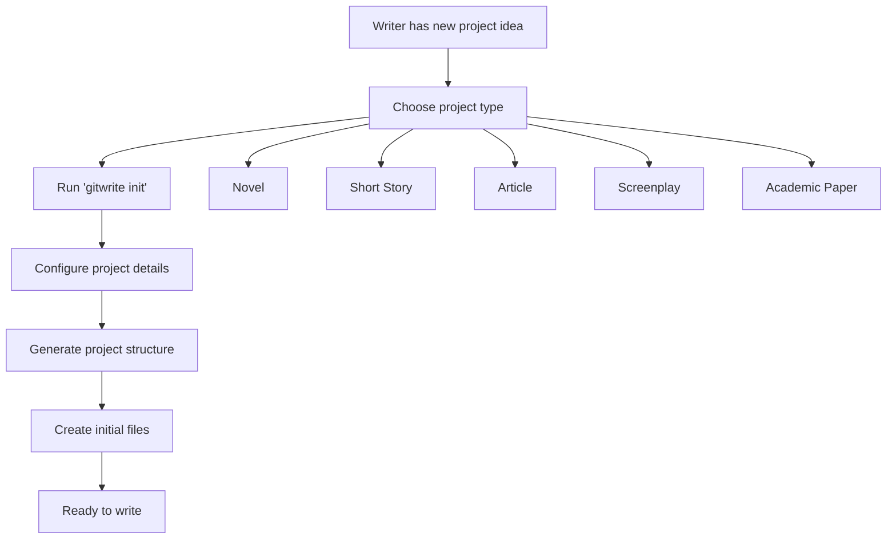
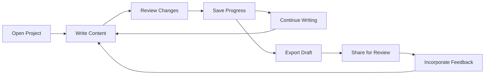
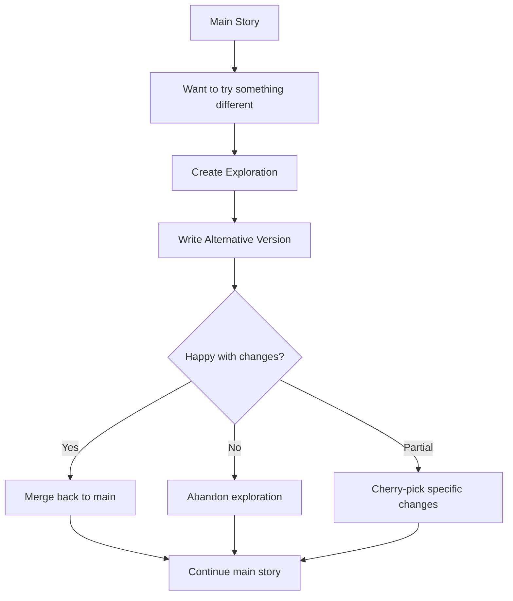
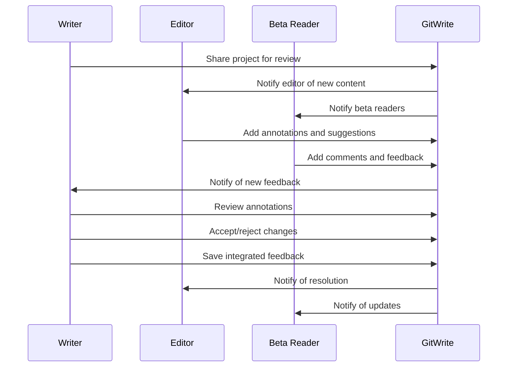
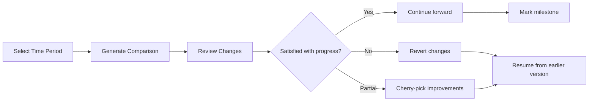
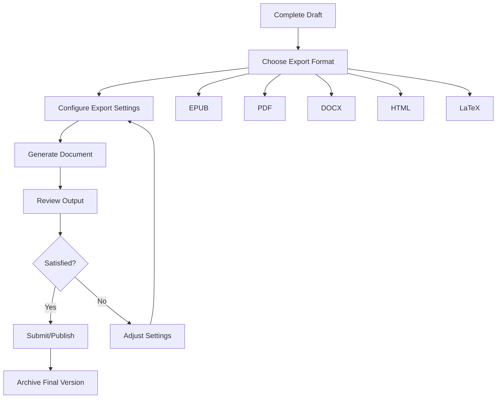

# User Workflows

GitWrite is designed around common writing workflows, transforming complex version control operations into intuitive writing processes. This section outlines the primary workflows that users engage with when using GitWrite for their writing projects.

## Workflow Overview

GitWrite supports several core workflows that mirror how writers actually work:

1. **Project Initialization** - Starting a new writing project
2. **Iterative Writing** - The daily writing and saving cycle
3. **Exploration & Experimentation** - Trying different approaches safely
4. **Collaboration & Review** - Working with editors and beta readers
5. **Version Comparison** - Examining changes and evolution
6. **Publishing & Export** - Preparing work for publication

## 1. Project Initialization Workflow

### Starting a New Project

The project initialization workflow sets up a complete writing environment optimized for the specific type of writing project.



#### Step-by-Step Process

**1. Project Type Selection**
```bash
# Choose from predefined templates
gitwrite init my-novel --type novel
gitwrite init my-article --type article
gitwrite init my-screenplay --type screenplay
```

**2. Project Configuration**
```bash
# Interactive setup (recommended for new users)
gitwrite init my-novel --interactive

# Direct configuration
gitwrite init my-novel \
  --author "Jane Writer" \
  --description "A thrilling adventure story" \
  --collaboration true
```

**3. Generated Structure**
After initialization, writers get a structured environment:
```
my-novel/
├── manuscript/
│   ├── chapters/           # Story content
│   ├── characters/         # Character development
│   ├── notes/             # Research and ideas
│   └── outline.md         # Story structure
├── .gitwrite/             # GitWrite configuration
├── README.md              # Project description
└── gitwrite.yaml          # Settings
```

**4. Initial Content Creation**
Writers start with helpful templates and prompts:
- Pre-filled outline template
- Character development sheets
- Research note templates
- Writing goal tracking

### Web UI Workflow

The web interface provides a visual project initialization:

1. **Project Creation Page**: Form with project details and template selection
2. **Template Preview**: See what structure will be created
3. **Collaboration Setup**: Invite editors and beta readers immediately
4. **Quick Start Guide**: Contextual help for new users

## 2. Iterative Writing Workflow

### The Daily Writing Cycle

This is the core workflow that writers use every day - the cycle of writing, reviewing, and saving progress.



#### Writing Session Workflow

**1. Starting a Writing Session**
```bash
# Open project and check status
cd my-novel
gitwrite status

# See what changed since last session
gitwrite history --recent

# Review any pending feedback
gitwrite annotations list --unread
```

**2. Active Writing Process**
- Writers work in their preferred text editor
- GitWrite tracks changes automatically (if auto-save enabled)
- Real-time word count and progress tracking
- Automatic backup every few minutes

**3. Progress Review**
```bash
# See what changed this session
gitwrite diff --since-last-save

# Word count and statistics
gitwrite stats --session
```

**4. Saving Progress**
```bash
# Save with descriptive message
gitwrite save "Completed chapter 3 - the revelation scene"

# Save specific files only
gitwrite save "Updated character backstory" --files characters/protagonist.md

# Tag important milestones
gitwrite save "First draft complete" --tag first-draft
```

### Auto-Save Features

For users who prefer automatic saving:
- **Smart Auto-Save**: Saves when pausing for 30+ seconds
- **Session-Based Saves**: Automatic save at end of writing session
- **Milestone Detection**: Automatically suggests tags for significant progress

## 3. Exploration & Experimentation Workflow

### Trying Different Approaches

Writers often want to experiment with different directions without losing their main work. GitWrite's exploration system makes this safe and intuitive.



#### Exploration Workflow

**1. Creating an Exploration**
```bash
# Create exploration for trying different approach
gitwrite explore create "alternative-ending" \
  --description "Trying a more dramatic conclusion"

# Start from specific point in history
gitwrite explore create "character-rewrite" \
  --from-commit a4f7b8c \
  --description "Rewriting protagonist from chapter 2"
```

**2. Working in Explorations**
```bash
# Switch to exploration
gitwrite explore switch "alternative-ending"

# Normal writing and saving
gitwrite save "Rewrote ending - much more dramatic"

# Check which exploration you're in
gitwrite status  # Shows current exploration
```

**3. Comparing Explorations**
```bash
# Compare different explorations
gitwrite compare "main" "alternative-ending"

# Visual diff of specific chapters
gitwrite diff "main:chapters/finale.md" "alternative-ending:chapters/finale.md"

# Word-level comparison in web UI
gitwrite web --compare main alternative-ending
```

**4. Integration Decisions**
```bash
# Merge entire exploration
gitwrite explore merge "alternative-ending" \
  --message "Using dramatic ending version"

# Cherry-pick specific changes
gitwrite explore cherry-pick alternative-ending abc123f \
  --message "Taking just the dialogue improvements"

# Abandon exploration
gitwrite explore delete "alternative-ending"
```

### Advanced Exploration Techniques

**Parallel Development**
```bash
# Work on multiple explorations
gitwrite explore create "first-person-narration"
gitwrite explore create "different-setting"
gitwrite explore create "darker-tone"

# Quick switching between approaches
gitwrite explore switch first-person-narration
# ... write content ...
gitwrite explore switch darker-tone
# ... write content ...
```

**Exploration Stashing**
```bash
# Temporarily save changes without committing
gitwrite stash "Halfway through scene rewrite"

# Switch to different exploration
gitwrite explore switch main

# Return and restore work
gitwrite explore switch first-person-narration
gitwrite stash pop
```

## 4. Collaboration & Review Workflow

### Working with Editors and Beta Readers

GitWrite provides structured workflows for incorporating feedback from editors, beta readers, and other collaborators.



#### Review Invitation Process

**1. Sharing for Review**
```bash
# Share with editor (full edit permissions)
gitwrite collaborate invite "editor@example.com" \
  --role editor \
  --message "Ready for your review of chapters 1-5"

# Share with beta readers (comment-only)
gitwrite collaborate invite "betareader@example.com" \
  --role beta-reader \
  --chapters "1,2,3"
```

**2. Managing Collaborators**
```bash
# List current collaborators
gitwrite collaborate list

# Update permissions
gitwrite collaborate update "editor@example.com" --role senior-editor

# Remove access
gitwrite collaborate remove "betareader@example.com"
```

#### Feedback Integration Workflow

**1. Receiving Feedback**
```bash
# Check for new feedback
gitwrite annotations list --new

# Review feedback by chapter
gitwrite annotations show chapter-3.md

# View all feedback from specific reviewer
gitwrite annotations list --author "editor@example.com"
```

**2. Processing Annotations**
```bash
# Accept suggestion
gitwrite annotations accept ann-123 \
  --message "Good catch on character motivation"

# Reject with explanation
gitwrite annotations reject ann-456 \
  --message "Keeping original for plot reasons"

# Modify suggestion before accepting
gitwrite annotations modify ann-789 \
  --new-text "Revised version incorporating the spirit of the suggestion"
```

**3. Batch Review Process**
```bash
# Review all pending feedback
gitwrite review start

# Interactive review mode
# - Shows each annotation
# - Allows accept/reject/modify
# - Provides context of surrounding text
# - Tracks decisions

# Complete review session
gitwrite review complete \
  --message "Incorporated editorial feedback on chapters 1-3"
```

### Editorial Workflow Patterns

**Developmental Editing**
- Large-scale structural feedback
- Character development suggestions
- Plot coherence issues
- Pacing and flow improvements

**Copy Editing**
- Grammar and style corrections
- Consistency checking
- Fact verification
- Language polish

**Proofreading**
- Final error checking
- Formatting verification
- Publication preparation

## 5. Version Comparison Workflow

### Tracking Changes Over Time

Writers need to understand how their work has evolved and compare different versions effectively.



#### Comparison Workflows

**1. Progress Tracking**
```bash
# Compare current work to yesterday
gitwrite compare --since yesterday

# Compare to specific milestone
gitwrite compare --since first-draft

# Compare word count progress
gitwrite stats --compare-to first-draft
```

**2. Quality Assessment**
```bash
# Readability analysis over time
gitwrite analyze --readability --since "2 weeks ago"

# Character development tracking
gitwrite analyze --characters --compare first-draft current

# Pacing analysis
gitwrite analyze --pacing chapters/
```

**3. Visual Comparisons**
```bash
# Launch web interface for visual diff
gitwrite web --compare-mode

# Generate side-by-side PDF comparison
gitwrite export pdf --compare first-draft current

# Create change summary report
gitwrite report changes --since first-draft --format html
```

#### Advanced Comparison Features

**Semantic Comparison**
- Compare meaning rather than just text changes
- Identify substantive vs. stylistic changes
- Track character consistency across versions
- Plot hole detection and resolution tracking

**Statistical Analysis**
- Word count trends over time
- Writing velocity patterns
- Chapter length distribution
- Vocabulary complexity evolution

## 6. Publishing & Export Workflow

### Preparing Work for Publication

The final workflow involves preparing manuscripts for publication in various formats.



#### Export Preparation

**1. Manuscript Finalization**
```bash
# Create final version tag
gitwrite tag create "final-manuscript-v1.0" \
  --message "Ready for submission to publisher"

# Clean up manuscript
gitwrite clean --remove-comments --fix-formatting

# Final validation
gitwrite validate --check-structure --check-consistency
```

**2. Export Configuration**
```bash
# Configure export templates
gitwrite export config epub \
  --template "professional-novel" \
  --cover-image "cover.jpg" \
  --metadata-file "book-info.yaml"

# Set publisher-specific requirements
gitwrite export config pdf \
  --margins "1in" \
  --font "Times New Roman" \
  --size "6x9" \
  --publisher "BigHouse Publishing"
```

**3. Document Generation**
```bash
# Generate single format
gitwrite export epub --output "My-Novel-v1.0.epub"

# Generate multiple formats
gitwrite export all \
  --formats epub,pdf,docx \
  --output-dir "submission-package/"

# Include version information
gitwrite export epub --include-version-info --include-change-log
```

#### Quality Assurance

**Pre-Export Validation**
- Spell checking and grammar validation
- Consistency checking (character names, plot points)
- Format validation (chapter structure, heading levels)
- Metadata completeness verification

**Post-Export Review**
- Generated document quality check
- Format-specific validation (EPUB validator, PDF/A compliance)
- Cross-platform compatibility testing
- Professional formatting verification

## Workflow Integration

### Cross-Workflow Features

**Universal Commands**
- `gitwrite status` - Works in any workflow context
- `gitwrite help` - Context-sensitive help
- `gitwrite undo` - Safe undo for any operation
- `gitwrite backup` - Manual backup creation

**Workflow Transitions**
- Seamless movement between workflows
- Preserved context when switching focus
- Automatic suggestion of next logical steps
- Integration points clearly marked

**Progress Tracking**
- Cross-workflow analytics and insights
- Writing habit pattern recognition
- Productivity optimization suggestions
- Long-term progress visualization

---

*These workflows form the foundation of the GitWrite user experience, providing structured yet flexible approaches to the various aspects of the writing process. Each workflow is designed to feel natural to writers while providing the full power of version control underneath.*